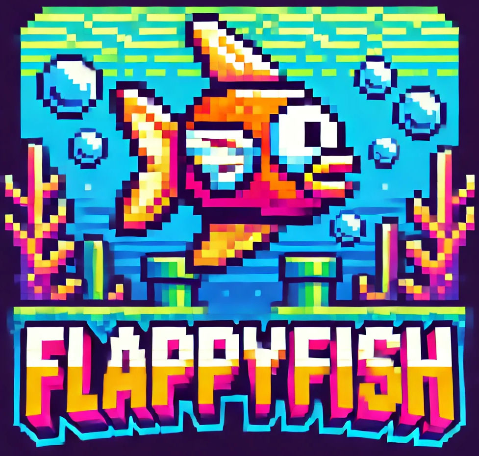
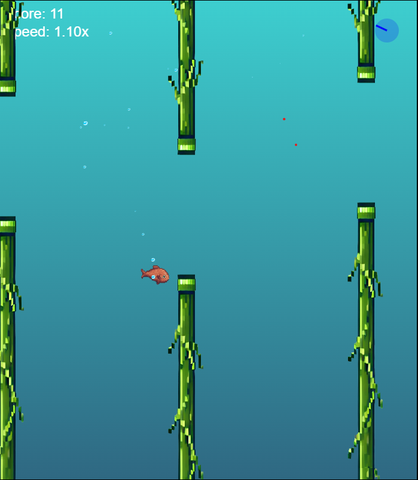

# Flappy Fish

Flappy Fish is an exciting game where you navigate a fish through various obstacles in an underwater world.

## Game Features

- **Dynamic Water Currents:** One unique feature of Flappy Fish is the inclusion of water currents that change direction, adding an extra layer of challenge and strategy to the game.
- **Score and Speed Display:** The current score and speed multiplier are displayed at the top left of the screen, helping players keep track of their progress and performance.
- **Aquatic Theme:** The game boasts a vibrant underwater setting with a blue gradient background, creating an immersive oceanic experience.

## How to play

Navigate the fish through obstacles using the WASD or arrow keys to avoid collisions and achieve the highest score.

## Screenshot

In the screenshot, the player’s fish is seen swimming between two sets of green columns that rise from the top and bottom of the screen. The fish is centrally positioned, facing right, and emits small bubbles, adding to the underwater ambiance.